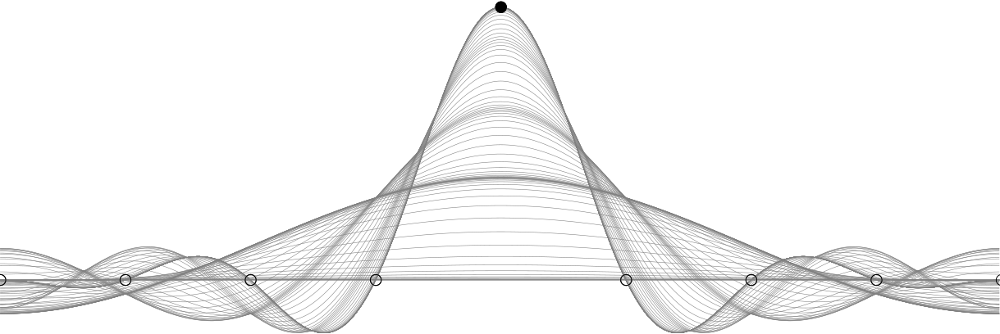

# Fast Cross-validation in Harmonic Approximation

## About

The `fcv` package is a Julia implementation for evaluating the ordinary cross-validation score and the generalized cross-validation score in various settings.
 * The `demos` folder contains examples on how to use this julia module


## Requirements

 * the equispaced examples on the torus use the `FFTW` module

## Citing

If you use `fcv` in your work, please cite the following:

```tex
@article{,
author = {Felix Bartel and Ralf Hielscher and Daniel Potts},
title = {Fast Cross-validation in Harmonic Approximation},
year = {2019},
eprint = {arXiv:1903.10206},
}
```
